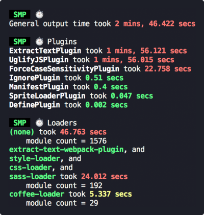

---
nav:
  title: 最佳实践
  order: 3
group:
  title: 构建优化
  order: 2
title: 构建分析
order: 1
---

# 构建分析

## 内置统计分析

如果你不希望使用 `quiet` 或 `noInfo` 这样的不显示信息，而是又不想得到全部的信息，只是想要获取某部分 `bundle` 的信息，使用 `stats` 选项是比较好的折衷方式。

有一些预设选项，可作为快捷方式。像这样使用它们：

```js
stats: 'errors-only';
```

<br />

| Preset          | Alternative | Description                    |
| :-------------- | :---------- | :----------------------------- |
| `"errors-only"` | `none`      | 只有发生错误时输出             |
| `"minimal"`     | `none`      | 只在发生错误或有新的编译时输出 |
| `"none"`        | `false`     | 没有输出                       |
| `"normal"`      | `true`      | 标准输出                       |
| `"verbose"`     | `none`      | 全部数据                       |

在 `package.json` 中使用 `stats`：

```json
{
  "scripts": {
    "build:stats": "webpack --env production --json > stats.json"
  }
}
```

缺点：颗粒度太粗，看不出问题所在。

更多的选项配置：[Webpack 统计信息](https://www.webpackjs.com/configuration/stats/#stats)

## 速度分析

对 Webpack 构建速度进行优化的首要任务就是去知道哪些地方值得我们注意。

[speed-measure-webpack-plugin](https://github.com/stephencookdev/speed-measure-webpack-plugin) 插件能够测量 Webpack 构建速度，并给出测量报告的输出：



从输出报告可以看到每个 loader 和 plugin 的执行耗时。

```js
const SpeedMeasurePlugin = require('speed-measure-webpack-plugin');

const smp = new SppedMeasurePlugin();

const webpackConfig = smp.wrap({
  plugins: [
    new HtmlWebpackPlugin(),
    new PreloadWebpackPlugin().,
  ]
})
```

速度分析插件作用：

- 分析整个打包总耗时
- 每个 loader 和 plugin 的耗时情况

## 体积分析

通过 [webpack-bundle-analyzer](https://github.com/webpack-contrib/webpack-bundle-analyzer) 插件能够在 Webpack 构建结束后生成构建产物体积报告，配合可视化的页面，能够直观知道产物中的具体占用体积。

```js
const BundleAnalyzerPlugin = require('webpack-bundle-analyzer').BundleAnalyzerPlugin;

module.exports = {
  plugins: [new BundleAnalyzerPlugin()],
};
```

插件生成的最终效果图如下：

```jsx | inline
import React from 'react';
import img from '../../assets/performance/webpack-bundle-analyzer-report.png';

export default () => ;
```

这个插件做的工作本质就是分析在 `compiler.plugin('done', function(stats))` 时传入的参数。[Stats](https://github.com/webpack/webpack/blob/webpack-4/lib/Stats.js#L29) 是 Webpack 的一个统计类。传入的实例如下图：

**stats**

```jsx | inline
import React from 'react';
import img from '../../assets/performance/webpack-bundle-analyzer-stats.png';

export default () => ;
```

**compilation**

```jsx | inline
import React from 'react';
import img from '../../assets/performance/webpack-bundle-analyzer-compilation.png';

export default () => ;
```

对 `Stats` 实例调用 `toJSON()` 方法，获取格式化信息。

这个插件就是从 `stats.json` 中获取 `chunks` 然后最终使用 Canvas 画图。具体代码位于 `analyzer.js` 中的 [getViewerData](https://github.com/webpack-contrib/webpack-bundle-analyzer/blob/master/src/analyzer.js#L20) 方法。
