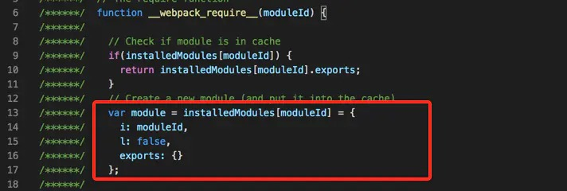
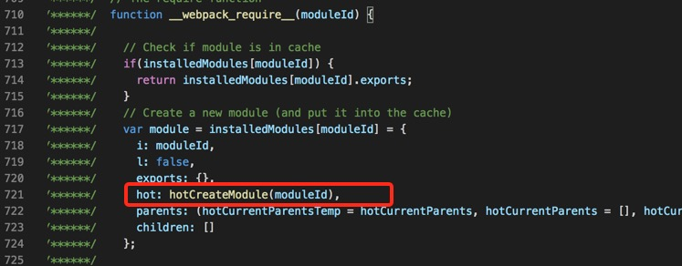
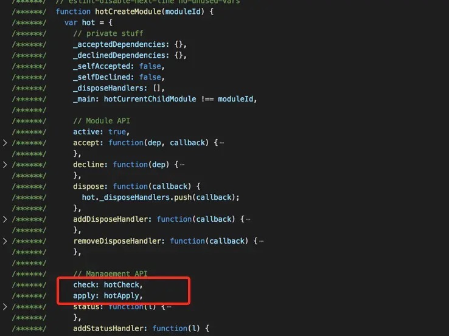
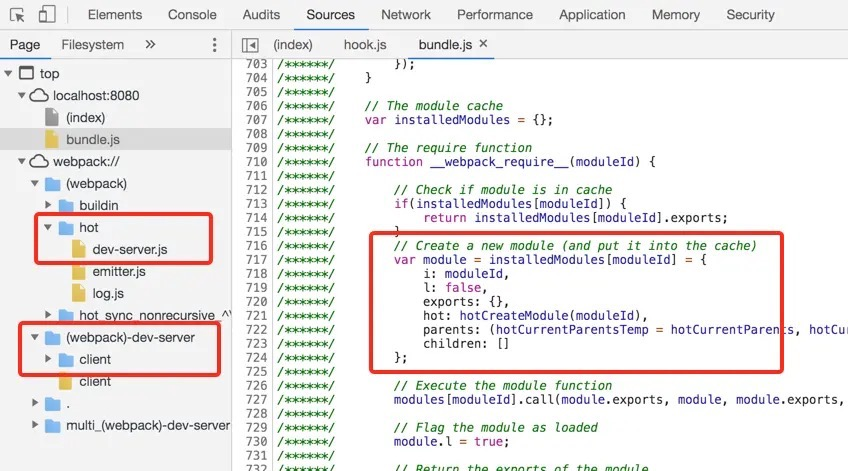

---
nav:
  title: 架构原理
  order: 2
group:
  title: 工作原理
  order: 1
title: 模块热更新
order: 6
---

# 模块热更新

> `Hot Module Replacement`（模块热更新），简称 `HMR`，是指在应用程序运行过程中，替换、添加或删除模块，而无需重新加载整个页面。主要通过以下几种方式，来显著加快开发速度：
>
> - 保留在完全重新加载页面期间丢失的应用程序状态
> - 只更新变更内容，以节省宝贵的开发时间
> - 在源代码中对 CSS / JS 进行修改，会立刻在浏览器中进行更新，这几乎相当于在浏览器 devtools 直接更改样式

而页面的刷新我们一般分为两种：

- 一种是页面刷新，**不保留页面状态**，就是简单粗暴，直接 `window.location.reload()`
- 另一种是基于 WDS (webpack-dev-server) 的模块热替换，只需要**局部刷新页面上发生变化的模块，同时可以保留当前的页面状态**，比如复选框的选中状态、输入框的输入等

相对于 Live Reload 刷新页面的方案，HMR 的优点在于可以保存应用的状态，提高了开发效率。

## 编译构建过程

下面我们通过一次打包构建了解编译构建的过程和需要关注的点。

项目启动后，进行构建打包，控制台会输出构建过程，我们可以观察到生成了一个 Hash 值：`a93fd735d02d98633356`。


然后，在我们每次修改代码保存后，控制台都会出现 `Compiling...` 字样，触发新的编译，可以在控制台中观察到：

- 新的 Hash 值：`a61bdd6e82294ed06fa3`
- 新的 JSON 文件： `a93fd735d02d98633356.hot-update.json`
- 新的 JS 文件：`index.a93fd735d02d98633356.hot-update.js`


首先，我们知道 Hash 值代表每一次编译的标识。

其次，根据新生成文件名可以发现，上次输出的 Hash 值会作为本次编译新生成的文件标识。依次类推，本次输出的 Hash 值会被作为下次热更新的标识。

然后看一下，新生成的文件是什么？每次修改代码，紧接着触发重新编译，然后浏览器就会发出 2 次请求。请求的便是本次新生成的 2 个文件。如下：


首先看 JSON 文件，返回的结果中：

- `h` 表示本次新生成的 Hash 值，用于下次文件热更新请求的前缀
- `c` 表示当前要热更新的文件对应的是 `index` 模块

再看下生成的 JS 文件，那就是本次修改的代码，重新编译打包后的。


还有一种情况是，如果没有任何代码改动，直接保存文件，控制台也会输出编译打包信息的。

- 新的 Hash 值：`d2e4208eca62aa1c5389`
- 新的 JSON 文件：`a61bdd6e82294ed06fa3.hot-update.json`


但是我们发现，并没有生成新的 JS 文件，因为没有改动任何代码，同时浏览器发出的请求，可以看到 `c` 值为空，代表本次没有需要更新的代码。


## 实现流程

```jsx | inline
import React from 'react';
import img from '../../assets/hmr/webpack-hmr-workflow.jpg';

export default () => ;
```

- 橙色框是浏览器端
- 红色框是服务端
- 绿色方框是 Webpack 代码控制的区域
- 蓝色方框是 webpack-dev-server 代码控制的区域
- 桃红色方框是文件系统，文件修改后的变化就发生在这
- 靛蓝色方框是应用本身

上图显示了我们修改代码到模块热更新完成的一个周期，通过深绿色的阿拉伯数字符号已经将 HMR 的整个过程标识了出来。

1. 第一步，在 webpack 的 watch 模式下，文件系统中某一个文件发生修改，webpack 监听（[文件监听的实现原理](./file-watch)）到文件变化，根据配置文件对模块 **重新编译打包**，并将打包后的代码通过简单的 JavaScript 对象保存在 <strong style="color: red">内存</strong> 中。

2. 第二步是 **webpack** 和 **webpack-dev-server** 之间的接口交互，而在这一步，主要是 webpack-dev-server 的中间件 webpack-dev-middleware 和 webpack 之间的交互，webpack-dev-middleware 调用 webpack 暴露的 API 对代码变化进行监控，并且告诉 webpack，将代码打包到内存中。

3. 第三步是 webpack-dev-server 对文件变化的一个监控，这一步不同于第一步，并不是监控代码变化重新打包。当我们在配置文件中配置了[devServer.watchContentBase](https://webpack.js.org/configuration/dev-server/#devserver-watchcontentbase) 为 `true` 的时候，Server 会监听这些配置文件夹中静态文件的变化，变化后会通知浏览器端对应用进行 live reload。注意，这儿是**浏览器刷新**，和 HMR 是两个概念。

4. 第四步也是 webpack-dev-server 代码的工作，该步骤主要是通过 [sockjs](https://github.com/sockjs/sockjs-client)（webpack-dev-server 的依赖）在浏览器端和服务端之间建立一个 **websocket 长连接**，将 webpack 编译打包的**各个阶段的状态信息**告知浏览器端，同时也包括第三步中 web-dev-server 监听静态文件变化的信息。浏览器端根据这些 socket 消息进行不同的操作。当然服务端传递的最主要信息还是 <strong style="color: red">新模块的 Hash 值</strong>，后面的步骤根据这一 Hash 值来进行模块热替换。

5. webpack-dev-server / client 端并不能够请求更新的代码，也不会执行热更模块操作，而把这些工作又交回给了 webpack，webpack / hot / dev-server 的工作就是根据 webpack-dev-server / client 传给它的信息以及 webpack-dev-server 的配置决定是**刷新浏览器**呢还是进行**模块热更新**。当然如果仅仅是刷新浏览器，也就没有后面那些步骤了。

6. HotModuleReplacement.runtime 是客户端 HMR 的中枢，它接收到上一步传递给他的新模块的 Hash 值，它通过 JsonpMainTemplate.runtime 向 server 端发送 AJAX 请求，服务端返回一个 JSON，该 JSON 包含了所有要更新的模块的 Hash 值，获取到更新列表后，该模块再次通过 JSONP 请求，获取到最新的模块代码。这就是上图中 7、8、9 步骤。

7. 而第 10 步是决定 HMR 成功与否的关键步骤，在该步骤中，HotModulePlugin 将会对 <strong style="color: red">新旧模块进行对比</strong>，决定是否更新模块，在决定更新模块后，检查模块之间的依赖关系，更新模块的同时更新模块间的依赖引用。

8. 最后一步，当 HMR 失败后，回退到 live reload 操作，也就是进行浏览器刷新来获取最新打包代码。

## 源码实现

```jsx | inline
import React from 'react';
import img from '../../assets/hmr/hmr-source-workflow.jpg';

export default () => ;
```

### 启动本地开发服务

我们根据 webpack-dev-server 的 `package.json` 中的 `bin` 命令，可以找到命令的入口文件 `bin/webpack-dev-server.js`。

```js
// node_modules/webpack-dev-server/bin/webpack-dev-server.js

// 生成 webpack 编译主引擎 compiler
let compiler = webpack(config);

// 启动本地服务
let server = new Server(compiler, options, log);
server.listen(options.port, options.host, (err) => {
  if (err) {
    throw err;
  }
});
```

本地服务代码：

```js
// node_modules/webpack-dev-server/lib/Server.js
class Server {
    constructor() {
        this.setupApp();
        this.createServer();
    }

    setupApp() {
        // 依赖了 Express
    	this.app = new express();
    }

    // 启动静态资源服务
    createServer() {
        this.listeningApp = http.createServer(this.app);
    }

    listen(port, hostname, fn) {
        return this.listeningApp.listen(port, hostname, (err) => {
            // 启动 Express 服务后，启动 WebSocket 服务，与浏览器端建立连接
            this.createSocketServer();
        }
    }
}
```

这一小节代码主要做了三件事：

- 启动 Webpack，生成 `compiler` 实例。`compiler` 上有很多方法，比如可以启动 Webpack 所有编译工作，以及监听本地文件的变化。
- 使用 Express 框架启动本地 Server，让浏览器可以请求本地的静态资源。
- 本地 Server 启动之后，再去启动 WebSocket 服务。通过 WebSocket，可以建立本地服务和浏览器的双向通信。当本地文件发生变化时，服务器会立马告知浏览器热更新代码。

上述代码主要干了三件事，但是源码在启动服务前又做了很多事，接下来便看看 `webpack-dev-server/lib/Server.js` 还做了哪些事？

### 修改构建配置

启动本地服务前，调用了 `updateCompiler(this.compiler)` 方法。这个方法中有两段关键性代码。一个是**获取 WebSocket 客户端代码路径**，另一个是**根据配置获取 Webpack 热更新代码路径**。

```js
// 获取 WebSocket 客户端代码
const clientEntry = `${require.resolve(
  '../../client/'
)}?${domain}${sockHost}${sockPath}${sockPort}`;

// 根据配置获取热更新代码
let hotEntry;
if (options.hotOnly) {
  hotEntry = require.resolve('webpack/hot/only-dev-server');
} else if (options.hot) {
  hotEntry = require.resolve('webpack/hot/dev-server');
}
```

修改后的 Webpack 入口配置如下：

```js
// 修改后的entry入口
{
  entry:
    {
      index:
        [
          // 上面获取的 clientEntry
          'xxx/node_modules/webpack-dev-server/client/index.js?http://localhost:8080',
          // 上面获取的 hotEntry
          'xxx/node_modules/webpack/hot/dev-server.js',
          // 开发配置的入口
          './src/index.js'
    	],
    },
}
```

为什么要新增了 2 个文件？在入口默默增加了 2 个文件，那就意味会一同打包到 `bundle` 文件中去，也就是**线上运行时**。

**webpack-dev-server/client/index.js**

首先这个文件用于 WebSocket 通信的，我们在第 1 步 webpack-dev-server 初始化的过程中，启动的是本地服务端的 Websocket。因此我们需要把 WebSocket 客户端通信代码与我们的代码打包在一起。

**webpack/hot/dev-server.js**

这个文件主要是用于检查更新逻辑的，这里大家知道就好，代码后面会在合适的时机（第 5 步）细讲。

### 监听构建编译完成

修改好入口配置后，又调用了 `setupHooks` 方法。这个方法是用来注册监听事件的，监听**每次 Webpack 编译完成**。

```js
// node_modules/webpack-dev-server/lib/Server.js

// 绑定监听事件
setupHooks() {
    const {done} = compiler.hooks;
    // 监听 Webpack 的 done 钩子，tapable 提供的监听方法
    done.tap('webpack-dev-server', (stats) => {
        this._sendStats(this.sockets, this.getStats(stats));
        this._stats = stats;
    });
};
```

当 Webpack 每次编译结束，就会调用 `_sendStats` 方法（webpack-dev-server 监听了 compiler 的 `done` 事件）通过 WebSocket 给浏览器发送通知（把重新编译打包后的新模块 Hash 值发送给浏览器端），进而触发 `ok` 和 `hash` 事件，这样浏览器就可以拿到最新的 Hash 值了，做检查更新逻辑。

```js
// 通过websoket给客户端发消息
_sendStats() {
    this.sockWrite(sockets, 'hash', stats.hash);
    this.sockWrite(sockets, 'ok');
}
```

### 监听文件变化

Webpack 对文件系统进行 `watch` 监听打包到内存中。

webpack-dev-middleware 调用 Webpack 的 API 对文件系统 watch，当代码文件发生改变后，Webpack 监听到文件发生变化后自动出发重新对文件的编译打包，然后保存到内存中。

很多人分不清 webpack-dev-middleware 和 webpack-dev-server 的区别。

- **webpack-dev-server**：只负责启动服务和前置准备工作
- **webpack-dev-middleware**：所有文件相关的操作都抽离至此，主要是本地文件的编译和输出以及监听

这样处理的目的是使得职的划分更加清晰。

那我们来看下 webpack-dev-middleware 源码里做了什么事:

[源码位置](https://github.com/webpack/webpack-dev-middleware/blob/955e53e1b5/index.js#L48)

```js
// node_modules/webpack-dev-middleware/index.js
// start watching
if (!options.lazy) {
  const watching = compiler.watch(options.watchOptions, (err) => {
    if (err) {
      /* 错误处理，代码精简省略 */
    }
  });

  context.watching = watching;
} else {
  context.state = true;
}

// 通过 memory-fs 库将打包后的文件写入内存
setFs(context, compiler);
```

1. 调用了 `compiler.watch` 方法，这个方法主要就做了 2 件事：

- 首先对本地文件代码进行编译打包，也就是 Webpack 的一系列编译流程
- 其次编译结束后，开启对本地文件的监听，当文件发生变化，重新编译，编译完成之后继续监听

为什么代码的改动保存会自动编译，重新打包？这一系列的重新检测编译就归功于 `compiler.watch` 这个方法了。监听本地文件的变化主要是通过 <strong style="color: red">文件的生成时间</strong> 是否有变化。

2. 执行 `setFs` 方法，这个方法主要目的就是 <strong style="color: red">将编译后的文件打包到内存</strong>。这就是为什么在开发的过程中，你会发现 `dist` 目录没有打包后的代码文件。原因就在于访问内存中的代码比访问文件系统中的文件更快，而且也减少了代码写入文件的开销，这一切都归功于 [memory-fs](https://github.com/webpack/memory-fs)（目前已使用 [memfs](https://github.com/streamich/memfs) 代替）。

### 通知浏览器文件变更

我们已经可以监听到文件的变化了，当文件发生变化，就触发重新编译。同时还监听了每次编译结束的事件。

当监听到一次 Webpack 编译结束，`_sendStats` 方法就通过 WebSoket 给浏览器发送通知，检查下是否需要热更新。下面重点讲的就是 `_sendStats` 方法中的 `ok` 和 `hash` 事件都做了什么。

那浏览器是如何接收到 WebSocket 的消息呢？回忆下第 2 步骤增加的入口文件，也就是 WebSocket 客户端代码。

```js
'xxx/node_modules/webpack-dev-server/client/index.js?http://localhost:8080';

```

这个文件的代码会被打包到 `bundle.js` 中，运行在浏览器中。来看下这个文件的核心代码吧。

```js
// webpack-dev-server/client/index.js
var socket = require('./socket');
var onSocketMessage = {
  hash: function hash(_hash) {
    // 更新currentHash值
    status.currentHash = _hash;
  },
  ok: function ok() {
    sendMessage('Ok');
    // 进行更新检查等操作
    reloadApp(options, status);
  },
};
// 连接服务地址 socketUrl，?http://localhost:8080，本地服务地址
socket(socketUrl, onSocketMessage);

function reloadApp() {
  if (hot) {
    log.info('[WDS] App hot update...');

    // hotEmitter 其实就是 EventEmitter 的实例
    var hotEmitter = require('webpack/hot/emitter');
    hotEmitter.emit('webpackHotUpdate', currentHash);
  }
}
```

`socket` 方法建立了 WebSocket 和服务端的连接，并注册了 2 个监听事件。

- `hash` 事件：更新最新一次打包后的 Hash 值
- `ok` 事件：对应用进行热更新检查（会根据 `hot` 配置决定是 **刷新浏览器** 还是对代码进行 **热更新（HMR）**）

热更新检查事件是调用 [reloadApp](https://github.com/webpack/webpack-dev-server/blob/75718b7e25a27da598340cb00e23628d9496cd1a/client-src/default/utils/reloadApp.js) 方法。比较奇怪的是，这个方法又利用 Node.js 的 EventEmitter，发出 `webpackHotUpdate` 消息。这是为什么？为什么不直接进行检查更新呢？

个人理解就是为了更好的维护代码，以及职责划分的更明确。WebSocket 仅仅用于客户端（浏览器）和服务端进行通信。而真正做事情的活还是交回给了 Webpack。

那 Webpack 怎么做的呢？再来回忆下第 2 步。入口文件还有一个文件没有讲到，就是：

```js
'xxx/node_modules/webpack/hot/dev-server.js';

```

这个文件的代码同样会被打包到 `bundle.js` 中，运行在浏览器中。这个文件做了什么就显而易见了吧！

先瞄一眼代码：

```js
// node_modules/webpack/hot/dev-server.js
var check = function check() {
  module.hot
    .check(true)
    .then(function (updatedModules) {
      // 容错，直接刷新页面
      if (!updatedModules) {
        window.location.reload();
        return;
      }

      // 热更新结束，打印信息
      if (upToDate()) {
        log('info', '[HMR] App is up to date.');
      }
    })
    .catch(function (err) {
      window.location.reload();
    });
};

var hotEmitter = require('./emitter');
hotEmitter.on('webpackHotUpdate', function (currentHash) {
  lastHash = currentHash;
  check();
});
```

结合上面代码，首先将 Hash 值暂存到 `currentHash` 变量，当接收到 `ok` 消息后，对应用程序进行 `reload`。如果配置了模块热更新，就调用 webpack/hot/emitter 将最新 Hash 值发送给 webpack，然后将控制权交给 Webpack 客户端代码（就是浏览器端代码）。如果没有配置模块热更新，就直接调用 `location.reload` 方法刷新页面。

这里 Webpack 监听到了 `webpackHotUpdate` 事件，并获取最新了最新的 Hash 值，然后终于进行检查更新了。检查更新调用的是 `module.hot.check` 方法。那么问题又来了，`module.hot.check` 又是哪里冒出来了的！答案是 HotModuleReplacementPlugin 搞得鬼。这里留个疑问，继续往下看。

### 热更新插件

热更新有最核心的是 HMR Server 和 HMR runtime。

- HMR Server 是服务端，用来将变化的 JS 模块通过 WebSocket 的消息通知给浏览器端。
- HMR Runtime 是浏览器端，用于接受 HMR Server 传递的模块数据，浏览器端可以看到 `.hot-update.JSON` 的文件过来。

前面好像一直是 webpack-dev-server 做的事，那 HotModuleReplacementPlugin 在热更新过程中又干了什么呢？

首先你可以对比下，配置热更新和不配置时 `bundle.js` 的区别。

内存中看不到？直接执行 Webpack 命令就可以看到生成的 `bundle.js` 文件啦。不要用 webpack-dev-server 启动就好了。

**没有配置热更新**



**配置热更新**



我们发现 `moudle` 新增了一个属性为 `hot`，再看 `hotCreateModule` 方法。 这不就找到 `module.hot.check` 是哪里冒出来的。



经过对比打包后的文件，`__webpack_require__` 中的 `moudle` 以及代码行数的不同。我们都可以发现 HotModuleReplacementPlugin 原来也是默默的塞了很多代码到 `bundle.js` 中。

你也可以直接看浏览器 Sources 下的代码，会发现 Webpack 和 plugin 偷偷加的代码都在哦。在这里调试也很方便。



HotModuleReplacementPlugin 如何做到的？这里我就不讲了，因为这需要你对 tapable 以及 plugin 机制有一定了解，可以看下 [Webpack 插件机制之 Tapable-源码解析](https://juejin.im/post/5dc169b0f265da4d542092c6)。

### 启动热更新

通过第 6 步，我们就可以知道 `moudle.hot.check` 方法是如何来的啦。那都做了什么？之后的源码都是 HotModuleReplacementPlugin 塞入到 `bundle.js` 中。

- 利用上次保存的 Hash 值，调用 `hotDownloadManifest` 发送 `xxx/hash.hot-update.json` 的 AJAX 请求；
- 请求结果获取热更新模块，以及下次热更新的 Hash 标识，并进入热更新准备阶段。

```js
// 需要更新的文件
hotAvailableFilesMap = update.c;

// 更新下次热更新 Hash 值
hotUpdateNewHash = update.h;

// 进入热更新准备状态
hotSetStatus('prepare');
```

调用 `hotDownloadUpdateChunk` 发送 `xxx/hash.hot-update.js` 请求，通过 JSONP 方式。

```js
function hotDownloadUpdateChunk(chunkId) {
  var script = document.createElement('script');
  script.charset = 'utf-8';
  script.src = __webpack_require__.p + '' + chunkId + '.' + hotCurrentHash + '.hot-update.js';
  if (null) script.crossOrigin = null;
  document.head.appendChild(script);
}
```

hotDownloadUpdateChunk 方法返回的就是最新 hash 值对应的代码块，然后将新的代码块返回给 HMR runtime，进行模块热更新

这个函数体为什么要单独拿出来，因为这里要解释下为什么使用 JSONP 获取最新代码？主要是因为 JSONP 获取的代码可以直接执行。为什么要直接执行？我们来回忆下 `/hash.hot-update.js` 的代码格式是怎么样的。


可以发现，新编译后的代码是在一个 `webpackHotUpdate` 函数体内部的。也就是要立即执行 `webpackHotUpdate` 这个方法。

再看下 `webpackHotUpdate` 这个方法。

```js
window['webpackHotUpdate'] = function (chunkId, moreModules) {
  hotAddUpdateChunk(chunkId, moreModules);
};
```

- `hotAddUpdateChunk` 方法会把更新的模块 `moreModules` 赋值给全局全量 `hotUpdate`
- `hotUpdateDownloaded` 方法会调用 `hotApply` 进行代码的替换。

```js
function hotAddUpdateChunk(chunkId, moreModules) {
  // 更新的模块 moreModules 赋值给全局全量 hotUpdate
  for (var moduleId in moreModules) {
    if (Object.prototype.hasOwnProperty.call(moreModules, moduleId)) {
      hotUpdate[moduleId] = moreModules[moduleId];
    }
  }
  // 调用 hotApply 进行模块的替换
  hotUpdateDownloaded();
}
```

为什么更新模块的代码不通过 webpack-dev-server 通过 WebSocket 发送到浏览器端，而是通过 JSONP 呢？

我的理解是，功能块的解耦，各个模块各司其职，dev-server/client 只负责消息的传递而不负责新模块的获取，而这些工作应该有 HMR runtime 来完成，HMR runtime 才应该是获取新代码的地方。再就是因为不使用 webpack-dev-server 的前提，使用 webpack-hot-middleware 和 Webpack 配合也可以完成模块热更新流程，在使用 webpack-hot-middleware 中有件有意思的事，它没有使用 WebSocket，而是使用的 EventSource。综上所述，HMR 的工作流中，不应该把新模块代码放在 WebSocket 消息中。

### 热更新模块替换

这步是整个模块热更新（HMR）的关键步骤，而且模块热更新都是发生在 HMR runtime 中的 `hotApply` 方法中。

模块热替换主要分三个阶段：

1. 找出 outdatedModules 和 outdatedDependencies，并从缓存中删除过期的模块和依赖
2. 添加新的模块到 `modules` 中
3. 当下次调用 `__webpack_require__`（Webpack 重写的 `require` 方法）方法的时候，就是获取到了新的模块代码了

#### 删除过期的模块

通过 `hotUpdate` 可以找到旧模块。

```js
var queue = outdatedModules.slice();
while (queue.length > 0) {
  moduleId = queue.pop();
  // 从缓存中删除过期的模块
  module = installedModules[moduleId];
  // 删除过期的依赖
  delete outdatedDependencies[moduleId];

  // 存储了被删掉的模块id，便于更新代码
  outdatedSelfAcceptedModules.push({
    module: moduleId,
  });
}
```

#### 添加新增模块

将新的模块添加到 `modules` 中。

```js
appliedUpdate[moduleId] = hotUpdate[moduleId];
for (moduleId in appliedUpdate) {
  if (Object.prototype.hasOwnProperty.call(appliedUpdate, moduleId)) {
    modules[moduleId] = appliedUpdate[moduleId];
  }
}
```

#### 执行相关模块代码

```js
for (i = 0; i < outdatedSelfAcceptedModules.length; i++) {
  var item = outdatedSelfAcceptedModules[i];
  moduleId = item.module;
  try {
    // 执行最新的代码
    __webpack_require__(moduleId);
  } catch (err) {
    // ...容错处理
  }
}
```

#### 模块热更新的错误处理

模块热更新的错误处理，如果在热更新过程中出现错误，热更新将回退到刷新浏览器，这部分代码在 dev-server 代码中，简要代码如下：

```js
module.hot
  .check(true)
  .then(function (updatedModules) {
    if (!updatedModules) {
      return window.location.reload();
    }
    // ...
  })
  .catch(function (err) {
    var status = module.hot.status();
    if (['abort', 'fail'].indexOf(status) >= 0) {
      window.location.reload();
    }
  });
```

`dev-server` 先验证是否有更新，没有代码更新的话，重载浏览器。如果在 `hotApply` 的过程中出现 `abort` 或者 `fail` 错误，也进行重载浏览器。

### 热更新总结

至此页面已经完成热更新，Webpack 如何实现热更新的呢？首先是建立起浏览器端和服务器端之间的通信，浏览器会接收服务器端推送的消息，如果需要热更新，浏览器发起 HTTP 请求去服务器端获取打包好的资源解析并局部刷新页面。

## 相关文件解析

- Webpack Compile：将 JS 编译成 Bundle
- HMR Server：将热更新的文件输出给 HMR Runtime
- Bundle Server：提供文件在浏览器的访问
- HMR Runtime：会被注入到浏览器，更新文件的变化
- bundle.js 构建输出的文件

### webpack-dev-server（WDS）

webpack-dev-server（WDS）的功能提供 bundle server 的能力，就是生成的 `bundle.js` 文件可以通过 `localhost://xxx` 的方式去访问，另外 WDS 也提供 livereload（浏览器的自动刷新）。

- 可以不刷新浏览器，打包构建不出文件，而是放在内存中
- 使用 HotModuleReplacementPlugin 插件

### webpack-dev-middleware

WDM 将 wepback 输出的文件传输给服务器

适用于灵活的定制场景

> 面试题：webpack-dev-server 和 webpack-dev-middleware 的详细区别，特别是使用场景

### hot-module-replacement-plugin

hot-module-replacement-plugin 的作用是提供 HMR 的 runtime，并且将 runtime 注入到 `bundle.js` 代码里面去。一旦磁盘里面的文件修改，那么 HMR server 会将有修改的 JS Module 信息发送给 HMR runtime，然后 HMR runtime 去局部更新页面的代码。**因此这种方式可以不用刷新浏览器。**

webpack-dev-server 和 hot-module-replacement-plugin 之间的关系：hot-module-replacement-plugin 包给 webpack-dev-server 提供了热更新的能力。

**HotModuleReplacementPlugin 是做什么用的？**

Webpack 构建出来的 `bundle.js` 本身是不具备热更新的能力的，HotModuleReplacementPlugin 的作用就是将 HMR runtime 注入到 `bundle.js`，使得 `bundle.js` 可以和 HMR server 建立 WebSocket 的通信连接

## 参考资料

- [🗃 webpack / hot / dev-server](https://github.com/webpack/webpack/blob/master/hot/dev-server.js)
- [🗃 webpack-dev-server](https://github.com/webpack/webpack-dev-server)
- [🗃 webpack-hot-middleware](https://github.com/webpack-contrib/webpack-hot-middleware)
- [📝 从零实现 Webpack 热更新 HMR（2023-12-14）](https://juejin.im/post/5df36ffd518825124d6c1765)
- [📝 轻松理解 Webpack 热更新原理（2023-12-01）](https://juejin.im/post/5de0cfe46fb9a071665d3df0)
- [📝 看完这篇，面试再也不怕被问 Webpack 热更新（2023-09-26）](https://juejin.im/post/5d8b755fe51d45781332e919)
- [📝 Webpack HMR 原理解析（2017-11-08）](https://zhuanlan.zhihu.com/p/30669007)
- [📝 Webpack 热更新实现原理分析（2017-10-31）](https://zhuanlan.zhihu.com/p/30623057)
- [📝 Webpack 与 browser-sync 热更新原理深度讲解（2017-04-20）](https://juejin.im/post/58f7fc7da0bb9f00659f7133)
- [🛠 搞懂 webpack 热更新原理：webpack-hmr](https://github.com/careteenL/webpack-hmr)
