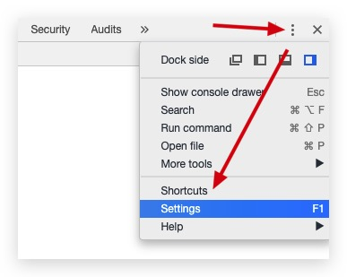
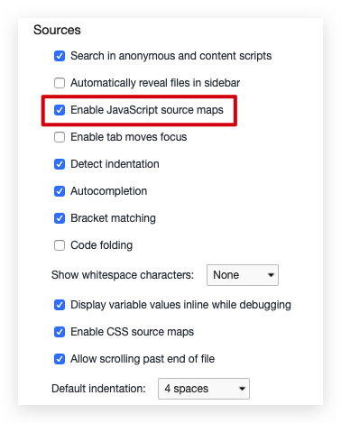

---
nav:
  title: 架构原理
  order: 2
group:
  title: 工作原理
  order: 1
title: SourceMap
order: 14
---

# SourceMap

SourceMap 就是一个信息文件，里面储存着代码的位置信息。这种文件主要用于开发调试，现在代码都会经过压缩混淆，这样报错提示会很难定位代码。通过 SourceMap 能快速定位到源代码，并进行调试。

通常情况 SourceMap 在开发环境开启，线上环境关闭。

应用场景：

- 开发期间，开发人员能直接通过浏览器调试工具直接定位错误或进行 Debug 调试
- 线上排查问题的时候可以将 SourceMap 上传到错误监控系统

## 调试指南

### 浏览器开启配置

一般浏览器会默认开启 SourceMap 调试，如果控制台不能显示源码错误位置，则需要打开配置。





打开浏览器的这个配置后，控制台的 `Console` 面板的错误提示，直接点击就会跳转到对应的源文件出错位置。

Sources 面板找到源文件，进行断点调试

如果没 Console 没报错，但是页面显示不正确。可以点击控制台的 Sources 面板，源文件都在 `webpack://` 目录下，或者直接搜索文件，打开源文件后进行断点调试。

> 按需加载的路由，只有页面加载了，源文件才会在这个目录下显示。

### Webpack 配置

Webpack devtool sourcemap 配置项：

| 值                      | 作用                                                                                                                                          | 建议使用环境 |
| ----------------------- | --------------------------------------------------------------------------------------------------------------------------------------------- | ------------ |
| eval                    | 每个模块都用 eval 封装进行运算，并且在末尾追加注释 `//@sourceURL`                                                                             | 开发环境     |
| source-map              | 生成 SourceMap 文件，并且会在每个 bundle 文件末尾追加注释 `//sourcemap=xx.js.map`                                                             | 生产环境     |
| hiden-source-map        | 与 source-map 作用一样，生成 SourceMap 文件，只是没有文件末尾的注释，默认查找 `xx.js.map` 文件                                                | 生产环境     |
| inline-source-map       | 生成一个 Base64 的 sourcemap 文件并注释追加在每个 bundle 文件的末尾                                                                           | 特定环境     |
| eval-source-map         | 每个 module 都用 eval 包裹执行，并在模块的末尾追加 DataURL 的 SourceMap                                                                       | 开发环境     |
| cheap-source-map        | 生成没有列信息（column-mappings）的 SourceMap 文件，不包含 loader 的 SourceMap（代码定位的是 Webpack 中配置的 loader 转换的代码，不是纯源码） | 特定环境     |
| cheap-module-source-map | 生成一个没有列信息（column-mappings）的 SourceMap 文件，同时 loader 的 sourcemap 被简化为只包含对应行                                         | 开发环境     |

其实就是 `source-map`、`inline`、`cheap` 和 `module` 的自由组合：

- `eval`：使用 eval 包裹模块代码
- `source map`：产生 `.map` 文件，每个 bundle 文件后缀家 sourcemap 的 sourceURL 或 dataURL，包括行列信息，loader 也有对应的 sourcemap
- `cheap`：sourcemap 中的 mappings 只有对应行信息，没有列文件，loader 也没有对应的 sourcemap，对应的都是 loader 转换后的代码，不是纯正的源代码
- `inline`：将 `.map` 作为 DataURI（Base64）嵌入，不单独生成 `.map` 文件（不推荐使用，因为这样会造成源代码体积巨大）
- `module`：包含 loader 的 sourcemap

## 配置分类

下面我们将列出这 7 种模式打包编译后的结果，从中看看他们的异同。

### eval

```js
webpackJsonp([1],[
  function(module,exports,__webpack_require__){
    eval(
      ...
      //# sourceURL=webpack:///./src/js/index.js?'
    )
  },
  function(module,exports,__webpack_require__){
    eval(
      ...
      //# sourceURL=webpack:///./src/static/css/app.less?./~/.npminstall/css-loader/0.23.1/css-loader!./~/.npminstall/postcss-loader/1.1.1/postcss-loader!./~/.npminstall/less-loader/2.2.3/less-loader'
    )
  },
  function(module,exports,__webpack_require__){
    eval(
      ...
      //# sourceURL=webpack:///./src/tmpl/appTemplate.tpl?"
    )
  },
...])
```

这样看很直观了，正如上文表格中的概念中写到，eval 模式会把每个 module 封装到 eval 里包裹起来执行，并且会在末尾追加注释。

### source-map

```js
webpackJsonp([1],[
  function(e,t,i){...},
  function(e,t,i){...},
  function(e,t,i){...},
  function(e,t,i){...},
  ...
])
//# sourceMappingURL=index.js.map
```

与此同时，你会发现你的 output 目录下多了一个 `index.js.map` 文件。

我们可以把这个 `index.js.map` 格式化一下，方便我们在下文的观察比较：

```js
{
  // SourceMap 版本
  "version": 3,
  // 转换后的文件名
  "file": 'index.js',
  // 转换前的文件所在目录，如果与转换前的文件在同一目录，该项为空
  "sourceRoot": '',
  // 转换前的文件
  "sources": [
    "webpack:///js/index.js",
    "webpack:///./src/js/index.js",
    "webpack:///./~/.npminstall/css-loader/0.23.1/css-loader/lib/css-base.js"
  ],
  // 转换前的所有变量名的属性名
  "names": ["webpackJsonp","module","exports"...],
  // 记录位置信息的字符串
  "mappings": "AAAAA,cAAc,IAER,SAASC...",
  // Webpack 生成的 SourceMap 有这一项，里面是模块源码
  "sourceContents": []
}
```

映射源代码的详解：

- version：sourcemap 版本（现在都是 v3）
- sources：源文件列表（如果是打包成 bundle.js 的，那源文件就有很长一堆了）
- sourcesContent: 原文件内容（如果是 webpack 压缩的，可以看到这里显示的代码是经 webpack 连接后的**webpack_require**那一层）
- names: 原变量名与属性名（压缩时可能会改变变量名称）
- mapping：映射 json
- file：编译后文件

### hidden-source-map

```js
webpackJsonp([1],[
  function(e,t,i){...},
  function(e,t,i){...},
  function(e,t,i){...},
  function(e,t,i){...},
  ...
])
```

与 source-map 相比少了末尾的注释，但 output 目录下的 `index.js.map` 没有少。

### inline-source-map

```js
webpackJsonp([1],[
  function(e,t,i){...},
  function(e,t,i){...},
  function(e,t,i){...},
  function(e,t,i){...},
  ...
])
//# sourceMappingURL=data:application/json;charset=utf-8;base64,eyJ2ZXJzaW9...
```

可以看到末尾的注释 SourceMap 作为 DataURL 的形式被内嵌进了 bundle 中，由于 sourceMap 的所有信息都被加到了 bundle 中，整个 bundle 文件变得硕大无比。

### eval-source-map

```js
webpackJsonp([1],[
  function(module,exports,__webpack_require__){
    eval(
      ...
      //# sourceMappingURL=data:application/json;charset=utf-8;base64,...
    )
  },
  function(module,exports,__webpack_require__){
    eval(
      ...
      //# sourceMappingURL=data:application/json;charset=utf-8;base64,...
    )
  },
  function(module,exports,__webpack_require__){
    eval(
      ...
      //# sourceMappingURL=data:application/json;charset=utf-8;base64,...
    )
  },
  ...
]);
```

和 eval 类似，但是把注释里的 sourceMap 都转为了 DataURL 。

### cheap-source-map

和 source-map 生成结果差不多。output 目录下的 `index.js` 内容一样。

但是 cheap-source-map 生成的 `index.js.map` 的内容却比 source-map 生成的 `index.js.map` 要少很多代码，我们对比一下上文 source-map 生成的`index.js.map` 的结果，发现 source 属性里面少了**列信息**，只剩一个`"webpack:///js/index.js"`。

```js
// index.js.map
{
  "version":3,
  "file":"js/index.js",
  "sources":["webpack:///js/index.js"],
  "sourcesContent":[...],
  "mappings":"AAAA",
  "sourceRoot":""
}
```

### cheap-module-source-map

```js
// index.js.map
{
  "version":3,
  "file":"js/index.js",
  "sources":["webpack:///js/index.js"],
  "mappings":"AAAA",
  "sourceRoot":""
}
```

在 cheap-module-source-map 下 sourceMap 的内容更少了，**sourceMap 的列信息**减少了，可以看到 sourcesContent 也没有了。

## 效率对比

不同的参数，生成的 SourceMap 不同，打包速度、体积、错误提示的效果也不同。

| devtool                        | 构建速度 | 重新构建速度 | 生产环境 | 品质（Quality）      |
| ------------------------------ | -------- | ------------ | -------- | -------------------- |
| (none)                         | +++      | +++          | yes      | 打包后的代码         |
| eval                           | +++      | +++          | no       | 生成后的代码         |
| cheap-eval-source-map          | +        | ++           | no       | 转换过代码（仅限行） |
| cheap-module-eval-source-map   | o        | ++           | no       | 原始源代码（仅限行） |
| eval-source-map                | --       | +            | no       | 原始源代码           |
| cheap-source-map               | +        | o            | yes      | 转换过代码（仅限行） |
| cheap-module-source-map        | o        | -            | yes      | 原始源代码（仅限行） |
| inline-cheap-source-map        | +        | o            | no       | 转换过代码（仅限行） |
| inline-cheap-module-source-map | o        | -            | no       | 原始源代码（仅限行） |
| source-map                     | --       | --           | yes      | 原始源代码           |
| inline-source-map              | --       | --           | no       | 原始源代码           |
| hidden-source-map              | --       | --           | yes      | 原始源代码           |
| nosoures-source-map            | --       | --           | yes      | 无源代码内容         |

> `+++` 非常快速、`++` 快速、`+` 比较快、`o` 中等、`-` 比较慢、`--` 慢

### 配置推荐

开发环境推荐：

cheap-module-eval-source-map

生产环境推荐：

cheap-module-source-map （这也是下版本 webpack 使用 `-d` 命令启动 debug 模式时的默认选项）

原因如下：

1. **使用 cheap 模式可以大幅提高 souremap 生成的效率。**大部分情况我们调试并不关心列信息，而且就算 sourcemap 没有列，有些浏览器引擎（例如 v8） 也会给出列信息。
2. **使用 eval 方式可大幅提高持续构建效率。**参考官方文档提供的速度对比表格可以看到 eval 模式的编译速度很快。
3. **使用 module 可支持 babel 这种预编译工具**（在 webpack 里做为 loader 使用）。
4. **使用 eval-source-map 模式可以减少网络请求。**这种模式开启 DataUrl 本身包含完整 sourcemap 信息，并不需要像 sourceURL 那样，浏览器需要发送一个完整请求去获取 sourcemap 文件，这会略微提高点效率。而生产环境中则不宜用 eval，这样会让文件变得极大。

## 安全问题

事情都是具有两面性的，方便调试的同时，也将源码暴露在控制台，可能会导致代码泄露的安全问题。
虽然说前端代码是公开的，但是代码的压缩混淆也一定程度上提高了安全性。

代码泄露可能导致的问题：

1. 代码被抄袭

场景：给 A 客户写了一个地图功能，A 客户展示给 B 客户，B 客户想要写地图，但是不会，查看源码后，抄走了地图功能

2. 业务流失

场景：竞争对手拿到了源码，挑出其中的漏洞或者缺陷，大肆宣传。或者直接写一份后台，成本少，价格低导致业务被抢走

3. 系统被攻击

场景：由于项目急，鉴权是通过前端动态生成路由控制的，后台没做判断，导致修改源码后，可以获得更多的权限（数据被删除）
例如常见的视频播放网站，如果不加密，直接一个 `<video>` 标签，那么就很容易被人拿到视频资源，自己的会员业务也会损失。

## 参考资料

- [JavaScript Source Map 详解](http://www.ruanyifeng.com/blog/2013/01/javascript_source_map.html)
- [你所不知道的 SourceMap](https://juejin.im/post/5e099ee3f265da33910a547d)
- [深入理解 SourceMap](https://juejin.im/post/5d0790996fb9a07f0052dbbb)
